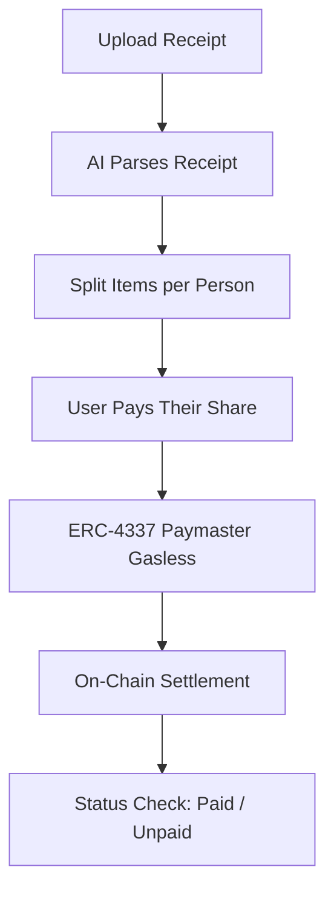

# ReceiptSplit

> **Snap a receipt, let AI settle the crypto bill with zero friction.**

ReceiptSplit is a consumer Web3 app that makes splitting everyday bills easy (eating out, movies, hangouts) using AI receipt parsing and gasless on-chain settlement on BNB Chain.

Built for **Indonesia Web3 Hackathon 2026** · Consumer Apps Track · Team **Tovix**

🔗 **Live app:** https://receiptsplit-1.ai.studio

🎥 **Demo video:** https://www.youtube.com/watch?v=xq9h_xqhLU8

---

## The Problem

- **Manual counting**: calculating each person's share by hand is slow and error-prone
- **Crypto payment friction**: paying friends in USDT means dealing with networks, gas fees, and long wallet addresses
- **No transparent settlement**: unpaid shares are hard to track

## The Solution

1. 📸 **Snap**: photograph the restaurant receipt
2. 🤖 **Parse**: Gemini Vision API extracts items, prices, tax, and service charge
3. ✂️ **Split**: assign who ordered what, with tax and service fees split proportionally
4. 💸 **Pay**: friends pay in USDT through an ERC-4337 smart wallet, with gas sponsored by a Paymaster (no BNB needed)
5. 🔗 **Settle**: every payment is an on-chain transfer, verifiable on BscScan



---

## Tech Stack

| Layer | Tech |
|---|---|
| **Frontend & Server** | Bun + Vite + React, Tailwind CSS, mobile-first |
| **AI Parser** | Gemini Vision API: structured receipt OCR → JSON |
| **Blockchain** | BNB Chain Testnet |
| **Smart Contract** | Solidity ^0.8.27, OpenZeppelin ERC-20 + Ownable, deployed with Remix IDE |
| **Account Abstraction** | ERC-4337 smart wallet, no browser extension and no BNB balance required |
| **Paymaster** | Sponsors 100% of gas fees for every settlement transaction |
| **Settlement Currency** | USDT (Tovix test token on testnet) |
| **App Data** | Firebase / Firestore |

---

## Smart Contract

**Tovix Test Token (BEP-20)** on BNB Chain Testnet, used as the settlement currency in place of USDT.

- Address: [`0xFbCA570f9AC782D54EFef73E7641FCbC40cA9105`](https://testnet.bscscan.com/address/0xFbCA570f9AC782D54EFef73E7641FCbC40cA9105#code)
- Source: [`contracts/Tovix.sol`](contracts/Tovix.sol)
- Verified on BscScan ✅

---

## How to Try (for Judges)

No installation needed. Just open the live app:

1. Open **https://receiptsplit-1.ai.studio** (use the **EN / ID** toggle in the header to switch language)
2. Click **Sign in with Google** so your receipts are saved to Cloud Firestore
3. Click **Snap New Receipt (AI)** and upload any restaurant receipt photo
4. Review the AI-parsed items, then assign who ordered what
5. Click **Pay my share with USDT**: gas is sponsored by the ERC-4337 Paymaster (0 BNB needed)
6. Click **View Proof** to check the settlement transaction on BscScan

---

## Business Model

ReceiptSplit is **free for everyday users**. Revenue comes from the value we create at settlement and from partners who benefit from smoother group payments.

| Revenue stream | How it works |
|---|---|
| **Settlement fee** | A small fee (target: 0.5%, capped) on each crypto settlement. It also funds the Paymaster that sponsors users' gas. |
| **Merchant integration** | Restaurants and cafes show a "Split with ReceiptSplit" QR at the cashier. Merchants pay a monthly plan for faster table turnover and fewer split-bill disputes. |
| **Premium groups** | Recurring splits (rent, subscriptions, trips), shared group history, and export for power users and communities. |

**Gas sustainability:** Paymaster costs on BNB Chain are low per transaction and are covered by the settlement fee, so gasless UX stays sustainable as volume grows.

---

## Roadmap

| Phase | Timeline | Milestones |
|---|---|---|
| **MVP** ✅ | Q4 2026 | AI receipt parsing (Gemini Vision), proportional split, ERC-4337 gasless payment on BSC Testnet, Firestore sync, EN/ID UI |
| **Mainnet** | Q1 2027 | BNB Chain mainnet launch with production Paymaster and real USDT, dedicated settlement contract, smart contract audit |
| **Social** | Q2 2027 | Telegram bot & Mini App that reads the group chat to auto-assign items, local fiat on/off-ramp partner |
| **Merchants** | Q3 2027 | Cashier QR integration for cafes and restaurants, multi-restaurant split history, recurring splits |
| **Expansion** | Q4 2027 | Expand to other Southeast Asian markets with a strong split-bill culture |

---

## Go-to-Market & Fundraising

- **Go-to-market:** start where splitting happens daily: students, young professionals, and hangout communities in Indonesia, then onboard partner cafes as distribution channels.
- **Funding path:** BNB Chain ecosystem grants and accelerator programs first, then a **pre-seed round** with Web3-focused VCs and angels after mainnet traction.
- **Use of funds:** smart contract audit, Paymaster gas reserve, Telegram integration, and merchant partnerships.
- **Key metrics:** monthly active groups, settlement volume (USDT), repeat-split rate, and number of partner merchants.

---

## Run Locally

**Prerequisites:** [Bun](https://bun.sh) and a Gemini API key

```bash
# 1. Install dependencies
bun install

# 2. Set up environment variables
cp .env.example .env
# then fill in your keys in .env

# 3. Start the app
bun run dev
```

---

## Project Structure

```
contracts/       Solidity smart contract (Tovix ERC-20)
src/             React frontend
server.ts        App server
firestore.rules  Firestore security rules
```

---

## Team

**Tovix** · Telegram [@Jou10](https://t.me/Jou10) · GitHub [Jou-arch](https://github.com/Jou-arch)
