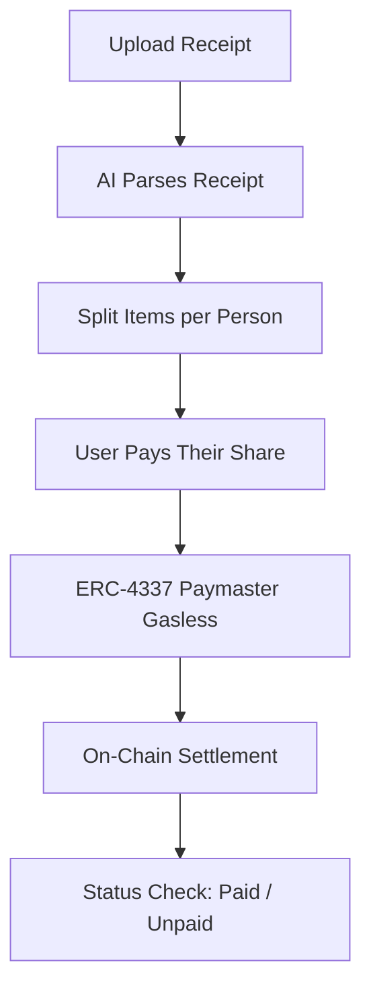

# The Solution

ReceiptSplit turns a receipt photo into a settled bill in five steps.

1. 📸 **Snap:** photograph the restaurant receipt
2. 🤖 **Parse:** Gemini Vision API extracts items, prices, tax, and service charge
3. ✂️ **Split:** assign who ordered what, with tax and service fees split proportionally
4. 💸 **Pay:** friends pay in USDT through an ERC-4337 smart wallet, with gas sponsored by a Paymaster (no BNB needed)
5. 🔗 **Settle:** every payment is an on-chain transfer, verifiable on BscScan

## Flow

